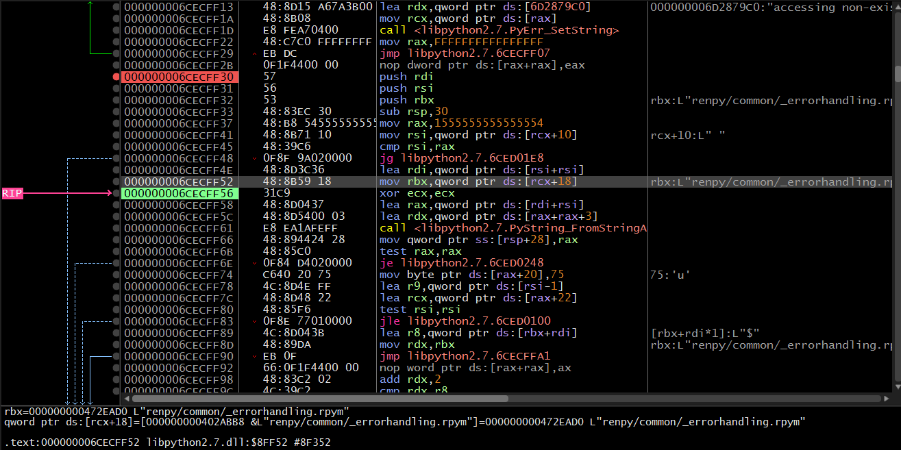
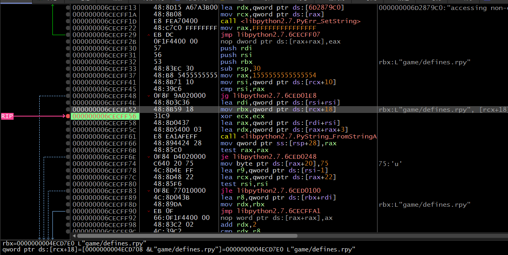
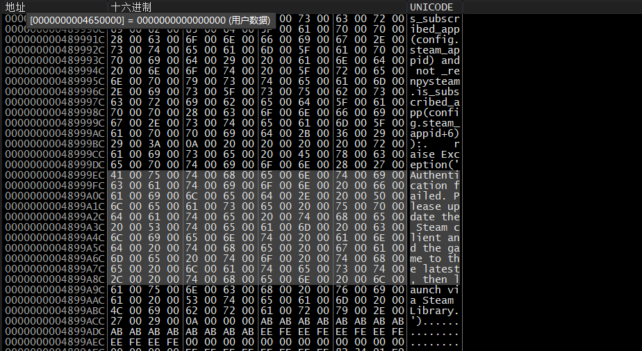
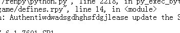
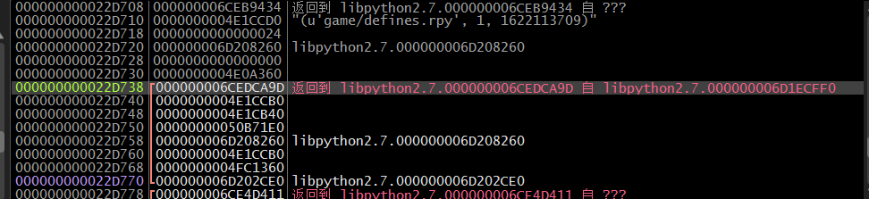
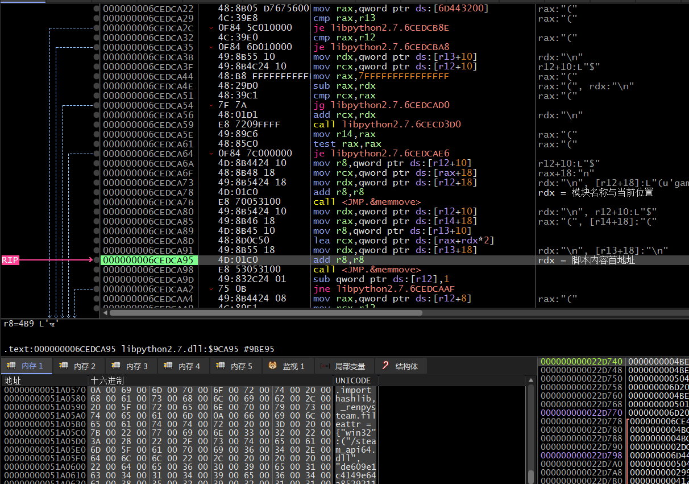
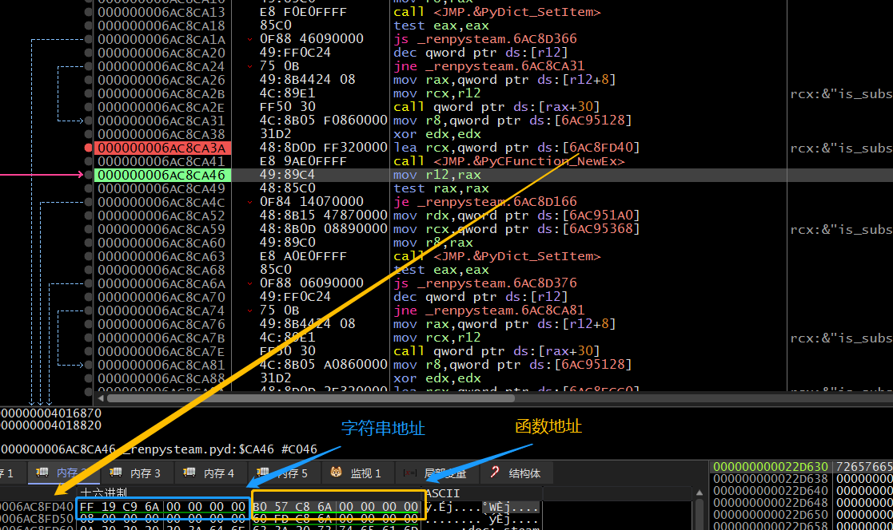
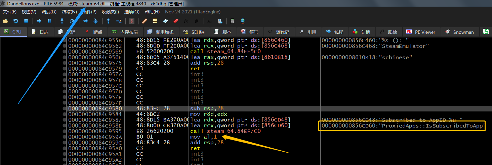

# Renpy-zedraxlo  (Renpy7.x Python2.7版本)游戏Crack手记

### 1.准备

​				1. x64dbg(64位版)

​				2. SteamAPI通用补丁

### 2.实例

​				夏空的蒲公英

​				忆夏之铃

​				王牌社团

​				东73

​				百曲

​				时间碎片EP0 奇迹

​				Blood Code

### 3.笔记

#### 3.1通用补丁初步尝试

​				本次实例采用《夏空的蒲公英》这部游戏为例，游戏没有SteamDRM壳，不过有SteamAPI认证，先使用通用SteamAPI进行处理，由于补丁支持hook，此处使用hook方法。修改导入表指向Steam通用补丁。


​				打开游戏，发现报错无法运行，显示以下内容，此异常是从game/defines.rpy这个脚本抛出，抛出以下字符串。

```ini
I'm sorry, but an uncaught exception occurred.

While running game code:
  File "game/defines.rpy", line 14, in <module>
Exception: Authentication failed. Please update the Steam client and the game to the latest, then launch via Steam Library.

-- Full Traceback ------------------------------------------------------------

Full traceback:
  File "./renpy\bootstrap.py", line 326, in bootstrap
  File "./renpy\main.py", line 515, in main
  File "defines.rpyc", line 1, in script
  File "defines.rpyc", line 1, in script
  File "./renpy\ast.py", line 922, in execute
  File "./renpy\python.py", line 2218, in py_exec_bytecode
  File "game/defines.rpy", line 14, in <module>
Exception: Authentication failed. Please update the Steam client and the game to the latest, then launch via Steam Library.

```

#### 3.2分析

##### 3.2.1定位

​				根据BKEngine的十二色季节的经验，针对脚本内认证检查，且为**Unicode编码**脚本，尝试使用**换行回车符**来进行定位，Renpy的主模块在libpython2.7.dll上，在此处下dll断点，载入dll后在该代码段搜索cmp ax,0xA

.png)

​				运行程序，触发了其中一个断点，取消断点继续运行，游戏直接认证检查后退出游戏，说明其他(cmp ax,0xA)指令断点没有被触发，删除其他断点，并观察当前断点的上下文以及寄存器的内容。

​				分析附近内存以及寄存器情况，猜测此处为脚本模块的加载处，取消当前断点，在该函数头下断点并重新运行。


​				断点触发后单步F8运行，直到此处rbx寄存器获取到**脚本模块名称**的首地址。



​				下断点继续运行，可以观察到有非常多的脚本模块名称，根据异常文本信息，需要找到那个define.rpy模块



##### 3.2.1 定位到内存中的脚本		

​				在内存搜索检查认证后抛出的异常的字符串，可以搜索到唯一结果。判断这段脚本是认证前还是认证后，修改抛出字符发现认证失败的文本文档内容也被修改了，判断出这段脚本为运行前。





##### 3.2.2找到何时获得脚本字符串的首地址

​				搜索脚本后，在脚本起始字符下Word硬件读取断点。断下后发现在系统模块移动字符串内容，恰好堆栈中看到上一层调用在libpython2.7.dll模块中



​				既然需要移动内存需要获得内存首地址，返回上一层libpython2.7.dll模块的函数中，在函数头下断点。重新运行游戏，先断到获取脚本模块名处，在启用搬运脚本内容函数处的断点。

​				此处获得了脚本模块名以及段落和脚本内容字符串的首地址。



​				dump下认证脚本并进行功能分析。

```python

import hashlib, _renpysteam
fileattr = {"win32":("/steam_api64.dll",   "de609e1c4149e64a852921115b163a3f", "7bf43b696060304797c57c719feb45cb"),
            "darwin":("/libsteam_api.dylib","a371243d9bad6b895a010d1543720254", "2a95befc8334b2be08937a7313b0c4dd"),
            "linux2":("/libsteam_api.so",   "f2c2a17b4db1701535a03ead8c71f7ba", "3a66932243a73b5b4bc4e243b685326b")}.get(sys.platform)
try:
    with open(_renpysteam.__file__, "rb") as wrapfile, open(str(os.path.dirname(_renpysteam.__file__), sys.getfilesystemencoding() or "utf-8")+fileattr[0], "rb") as sapifile:
        wraphash, sapihash = hashlib.md5(wrapfile.read(998)).hexdigest(), hashlib.md5(sapifile.read(998)).hexdigest()
        # 读取renpysteam.pyd与steam_api64.dll模块的前998字节(猜测),计算MD5
except:
    wraphash, sapihash = None, None		#如果模块不存在此处清空计算值 保证下面文件校验退出游戏
#与原MD5比较 比较不通过则退出游戏 由于使用hook法  导入表在998字节开外 此检查没有触发
if wraphash != fileattr[1] or sapihash != fileattr[2]:
    raise Exception('Loading failed. Please place the game under the ASCII folder path and verify the game integrity via Steam.')
#检查Steam初始化与商店AppID  如认证失败则退出游戏
if not (_renpysteam.init() and _renpysteam.is_subscribed_app(config.steam_appid) and not _renpysteam.is_subscribed_app(config.steam_appid+6)):
#此处认证的AppID+6 利用的通杀SteamApi补丁对所有ID都认证通过的bug 认证不存在的ID检查通杀补丁  检查到则退出游戏
    raise Exception('Authentication failed. Please update the Steam client and the game to the latest, then launch via Steam Library.')

```

##### 3.2.3 修改代码制作补丁

​				可以直接使用BKEngine的《十二色的季节》的方法，检查敏感内存后修改内存。此处为另外一种方法。

​				认证函数中调用了**_renpysteam.is_subscribed_app检查游戏订阅情况**，结合github中的该模块源码，在_renpysteam.pyd中搜索字符串"is_subscribed_app"，下断点运行。

​				[Renpy中Steam模块源码]()


​				查阅资料可以得到PyCFunction_NewEx功能与参数，可以得到该函数第一个参数为函数相关信息的结构体对象，结构体的第二个字段为函数地址(此游戏为64位，则字段偏移为+0x8)，跟进此函数的地址，并且下断点分析。

``` c
//函数定义
PyObject* PyCFunction_New(PyMethodDef* ml, PyObject* data);

//PyMethodDef结构体定义
struct PyMethodDef 
{
    const char  *ml_name;   /* 函数名称 */
    PyCFunction ml_meth;    /* 函数地址 */
    int         ml_flags;   /* Combination of METH_xxx flags, which mostly
                               describe the args expected by the C func */
    const char  *ml_doc;    /* The __doc__ attribute, or NULL */
};

```



```assembly
000000006AC857B0 | 41:55             push r13                                         
000000006AC857B2 | 41:54             push r12                                         
000000006AC857B4 | 48:83EC 38        sub rsp,38                                       
000000006AC857B8 | 48:8B42 08        mov rax,qword ptr ds:[rdx+8]                     
000000006AC857BC | 49:89D5           mov r13,rdx                                      
000000006AC857BF | 8B90 A8000000     mov edx,dword ptr ds:[rax+A8]                    
000000006AC857C5 | F7C2 00008000     test edx,800000                                  
000000006AC857CB | 74 5B             je _renpysteam.6AC85828                          
000000006AC857CD | 41:8B55 10        mov edx,dword ptr ds:[r13+10]                    ; edx=AppID
000000006AC857D1 | 85D2              test edx,edx                                     
000000006AC857D3 | 0F88 87000000     js _renpysteam.6AC85860                          
000000006AC857D9 | 41:89D4           mov r12d,edx                                     ; r12d=AppID
000000006AC857DC | 48:8D0D 4DAF0000  lea rcx,qword ptr ds:[6AC90730]                  
000000006AC857E3 | FF15 BB1F0100     call qword ptr ds:[<&SteamInternal_ContextInit>] 
000000006AC857E9 | 44:89E2           mov edx,r12d                                     ; edx=AppID
000000006AC857EC | 48:8B08           mov rcx,qword ptr ds:[rax]                       
000000006AC857EF | 48:8B01           mov rax,qword ptr ds:[rcx]                       
000000006AC857F2 | FF50 30           call qword ptr ds:[rax+30]                       ; Steam订阅认证
000000006AC857F5 | 84C0              test al,al                                       
000000006AC857F7 | 75 17             jne _renpysteam.6AC85810                         
000000006AC857F9 | 48:8B05 3C220100  mov rax,qword ptr ds:[<&_Py_ZeroStruct>]         ; 认证失败返回0
000000006AC85800 | 48:8300 01        add qword ptr ds:[rax],1                         
000000006AC85804 | 48:83C4 38        add rsp,38                                       
000000006AC85808 | 41:5C             pop r12                                          
000000006AC8580A | 41:5D             pop r13                                          
000000006AC8580C | C3                ret                                              
000000006AC8580D | 0F1F00            nop dword ptr ds:[rax],eax                       
000000006AC85810 | 48:8B05 1D220100  mov rax,qword ptr ds:[<&_Py_TrueStruct>]         ; 认证成功返回1
000000006AC85817 | 48:8300 01        add qword ptr ds:[rax],1                         
000000006AC8581B | 48:83C4 38        add rsp,38                                       
000000006AC8581F | 41:5C             pop r12                                          
000000006AC85821 | 41:5D             pop r13                                          
000000006AC85823 | C3                ret                                              
```



​				分析得到在renpysteam的认证函数与通用补丁对订阅检查永远返回1的特性。可以修改代码，检查AppID是否为“不存在的ID”，如果是则让他返回0。


​				修改保存后重命名，运行游戏，游戏正常运行。


